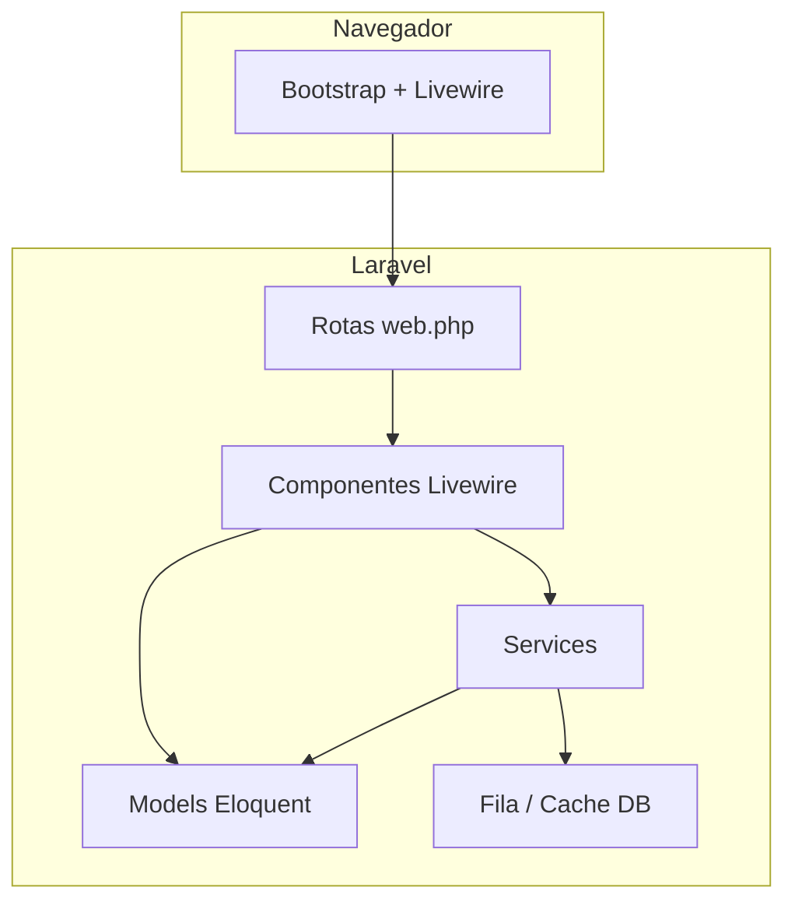

# devops-laravel

<p align="center">
  <strong>Laboratório pessoal de DevOps com Laravel como aplicação de referência</strong><br>
  Código versionado, ambiente reproduzível e práticas de entrega contínua — aprendendo na prática.
</p>

<p align="center">
  
  
  
  
  
</p>

---

## Sobre o projeto

**devops-laravel** não é um produto comercial: é um **projeto pessoal** criado para estudar e aplicar conceitos de **DevOps** usando uma aplicação web real como laboratório.

Em vez de estudar pipelines e containers no vácuo, este repositório oferece um app Laravel com rotas, filas, cache em banco, testes e interface reativa — e serve de base para praticar:

- versionamento e convenções de equipe;
- setup reproduzível (`composer setup`, `.env.example`);
- qualidade de código (Pint, PHPUnit);
- containerização e CI/CD (roadmap);
- observabilidade e deploy.

**DevOps** como objetivo de aprendizado; **Laravel** como stack da aplicação.

---

## O que já existe hoje

| Área | Status |
|------|--------|
| App web Laravel 13 + PHP 8.3 | ✅ |
| UI com Livewire 4 (componentes em Blade) | ✅ |
| Layout Bootstrap 5 + Vite | ✅ |
| SQLite + migrations (users, cache, jobs) | ✅ |
| Filas e cache via `database` | ✅ |
| Scripts Composer (`setup`, `dev`, `test`) | ✅ |
| Regras do Cursor (`.cursor/rules/`) | ✅ |
| Docker / Compose | 🔜 planejado |
| GitHub Actions (CI) | 🔜 planejado |
| Deploy automatizado | 🔜 planejado |

**Rota principal:** `GET /home` — painel Livewire (contador, formulário reativo, cards).

---

## Stack técnica

| Camada | Tecnologia |
|--------|------------|
| Runtime | PHP 8.3+ |
| Framework | Laravel 13 |
| Frontend reativo | Livewire 4.2 |
| UI | Bootstrap 5 |
| Build | Vite 8 |
| Banco (dev padrão) | SQLite |
| Testes | PHPUnit 12 |
| Formatação | Laravel Pint |
| Logs locais | Laravel Pail (`composer dev`) |

---

## Arquitetura



**Convenções** (detalhes em `.cursor/rules/devops_laravel.mdc`):

- **MVC:** rotas finas; controllers só para HTTP clássico quando necessário.
- **Livewire:** telas interativas e estado de UI.
- **Services (`app/Services/`):** regras de negócio — Livewire delega, não concentra lógica pesada.

---

## Estrutura de pastas

```
devops-laravel/
├── app/
│   ├── Http/Controllers/
│   ├── Models/
│   ├── Providers/
│   └── Services/
├── database/migrations/
├── resources/views/
│   ├── layouts/app.blade.php
│   └── components/
├── routes/web.php
├── tests/
├── .cursor/rules/
└── composer.json
```

---

## Pré-requisitos

- PHP 8.3+ (extensões do Laravel)
- [Composer](https://getcomposer.org/)
- [Node.js](https://nodejs.org/) 18+ e npm
- Git

---

## Instalação

```bash
git clone <url-do-repositorio> devops-laravel
cd devops-laravel
composer setup
```

Passo a passo:

```bash
composer install
cp .env.example .env
php artisan key:generate
touch database/database.sqlite
php artisan migrate
npm install
npm run build
```

Desenvolvimento (servidor + fila + logs + Vite):

```bash
composer dev
```

Acesse: **http://localhost:8000/home**

---

## Comandos úteis

| Comando | Descrição |
|---------|-----------|
| `composer dev` | Servidor, queue, Pail e Vite |
| `composer test` | PHPUnit |
| `php artisan migrate` | Migrations |
| `./vendor/bin/pint` | Formata PHP |
| `npm run dev` | Vite watch |
| `npm run build` | Build produção |

---

## Variáveis de ambiente

```env
APP_NAME="devops-laravel"
APP_URL=http://localhost:8000
DB_CONNECTION=sqlite
QUEUE_CONNECTION=database
CACHE_STORE=database
SESSION_DRIVER=database
```

---

## Testes

```bash
composer test
```

---

## Roadmap DevOps

- [ ] Dockerfile multi-stage
- [ ] docker-compose.yml
- [ ] GitHub Actions (Pint + PHPUnit + build)
- [ ] Ambientes staging/production documentados
- [ ] Health check para load balancer
- [ ] Deploy em VPS ou PaaS

---

## Contribuição

Projeto pessoal; forks e PRs são bem-vindos para estudo. Antes do PR: `composer test`, Pint, e sem `.env` no Git.

---

## Licença

MIT.

---

## Autor

Eduardo Cintas — aprendizado em DevOps e Laravel.

- GitHub: [@eduardocintas8](https://github.com/eduardocintas8)
